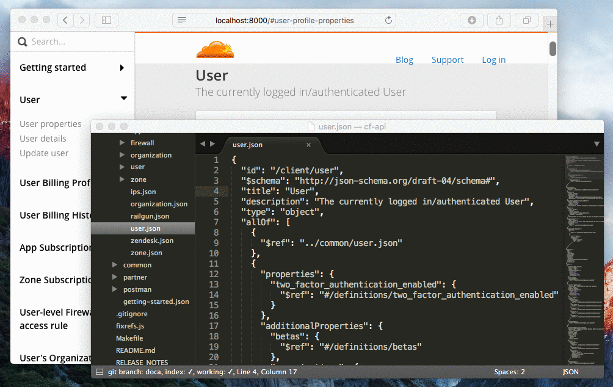
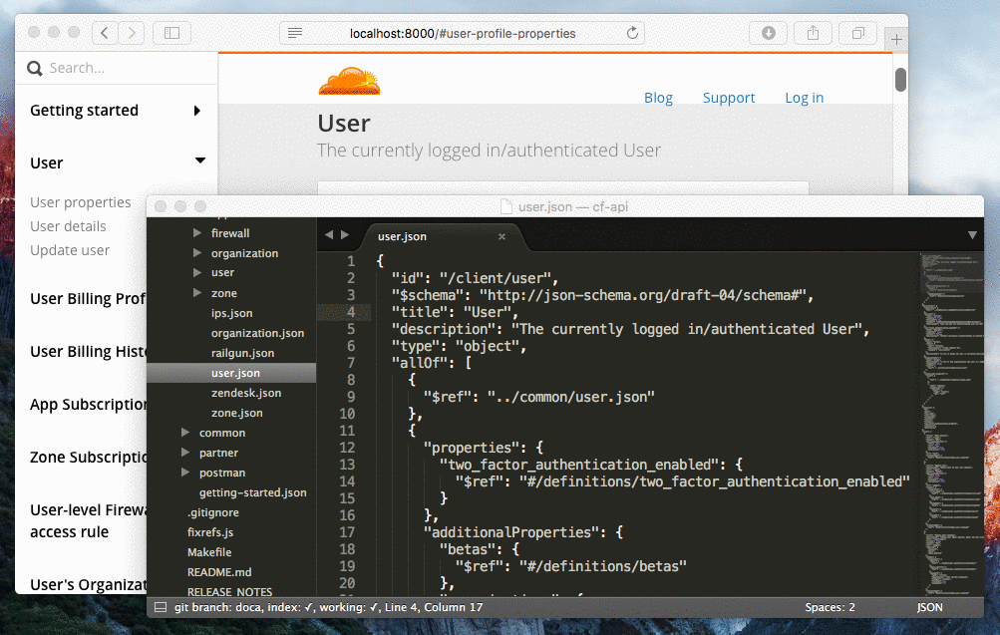

# Open Sourcing CloudFlare's Docs Generator

CloudFlare exposes its entire infrastructure via a RESTful API. In order to keep track of all our endpoints, we use a rich notation called [JSON Hyper-Schema](http://json-schema.org/). These schemas are (not only) used to generate the complete HTML documentation that you can see at [https://api.cloudflare.com](https://api.cloudflare.com). Today, we want to share a set of tools that we use in this process.

## JSON Schema

JSON Schema is a powerful way to describe your JSON data format. It provides **complete structural validation** and can be used for things like validation of incoming requests. JSON Hyper-Schema further extends this format with links and gives you a way to verbally describe your API.

### JSON Schema Example

```json
{
  "type": "object",
  "properties": {
    "name": { "type": "string" },
    "age": { "type": "number" },
    "address": {
      "type": "object",
      "properties": {
        "street_address": { "type": "string" },
        "city": { "type": "string" },
        "state": { "type": "string" },
        "country": { "type" : "string" }
      }
    }
  }
}
```

### Matching JSON

```json
{
  "name": "John Doe",
  "age": 45,
  "address": {
    "street_address": "2433 State St NW",
    "city": "Atlanta",
    "state": "Georgia",
    "country": "United States"
  }
}
```

JSON Schema supports all simple data types. It also defines some special meta properties including title, description, default, enum, id, $ref, $schema, allOf, anyOf, oneOf, and more. The most powerful construct is $ref. It provides similar functionality as hypertext links. You can reference external schemas (external reference) or a fragment inside the current schema (internal reference). This way you can easily compose and combine multiple schemas together without repeating yourself.

JSON Hyper-Schema introduces another property called **links** where you define your API links, methods, request and response formats, etc. The best way to learn more about JSON Schemas is to visit [Understanding JSON Schema](https://spacetelescope.github.io/understanding-json-schema/). You can also visit the official [specification website](http://json-schema.org/) or [wiki](https://github.com/json-schema/json-schema/wiki). If you want to jump straight into examples, try [this](https://github.com/cloudflare/doca/tree/master/example).

## Generating Documentation: Tools

We already have an open source library that can generate a complete HTML documentation from JSON Schema files and [Handlebars.js](http://handlebarsjs.com/) templates. It's called [JSON Schema Docs Generator (JSDC)](https://github.com/cloudflare/json-schema-docs-generator). However, it has some drawbacks that make it hard to use for other teams:

- Complicated configuration
- It's necessary to rebuild everything with every change (slow)
- Templates cannot have their own dependencies
- All additional scripting must be in a different place
- It is hard to further customize it (splitting into sections, pages)

We wanted something more modular and extensible that addresses the above issues, while still getting some ready-to-go output just with a few commands. So, we created a toolchain based on JSDC and modern JavaScript libraries. This article is not just a description for how to use these tools, but also an explanation of our design decisions. **It is described in a bottom-up manner.** You can skip to the bottom if you are not interested in the technical discussion and just want to get started using the tools.

### [json-schema-loader](https://github.com/cloudflare/json-schema-loader)

JSON Schema files need to be preprocessed first. **The first thing we have to do is to resolve their references ($ref).** This can be quite a complex task since every schema can have multiple references, some of which are external (referencing even more schemas). Also, when we make a change, we want to only resolve schemas that need to be resolved. We decided to use [Webpack](https://webpack.github.io/) for this task because webpack loaders have some great properties:

- It's a simple function that transforms input into output
- It can **maintain and track additional file dependencies**
- It can cache the output
- It can be chained
- Webpack watches all changes in required modules and their dependencies

Our loader is using a 3rd party [JSON Schema Ref Parser](https://github.com/BigstickCarpet/json-schema-ref-parser) library. It does not adhere to JSON Schema specification related to id properties and their ability of changing reference scope since it is [ambiguous](https://github.com/json-schema/json-schema/wiki/The-%22id%22-conundrum). However, it does implements the [JSON Pointer](https://tools.ietf.org/html/rfc6901) and [JSON Reference](https://tools.ietf.org/html/draft-pbryan-zyp-json-ref-03) specifications. What does this mean? You can still combine relative (or absolute) paths with JSON Pointers and use references like:

```
 "$ref": "./product.json#/definitions/identifier"
```

but ids are simply ignored and the scope is always relative to the root. That makes reasoning about our schemas easier. That being said, a unique root id is still expected for other purposes.

### [json-schema-example-loader](https://github.com/cloudflare/json-schema-example-loader)

Finally, we have resolved schemas. Unfortunately, their structure doesn't really match our final HTML documentation. It can be deeply nested, and we want to present our users with nice examples of API requests and responses. We need to do further transformations. We must remove some original properties and precompute new ones. **The goal is to create a data structure that will better fit our UI components.** Please check out the [project page](https://github.com/cloudflare/json-schema-example-loader) for more details.

You might be asking why we use another webpack loader. This could be a part of our web application instead. The main reason is performance. We do not want to bog down browsers by doing these transformations repeatedly since JSON Schemas can be arbitrarily nested and very complex.

### [doca-bootstrap-theme](https://github.com/cloudflare/doca-bootstrap-theme)

With both of these webpack loaders, you can easily use your favorite JavaScript framework to build your own application. However, we want to make docs generation accessible even to people who don't have time to build their own app. So, we  created a set of templates that matches the output of [json-schema-example-loader](https://github.com/cloudflare/json-schema-example-loader). These templates are using the popular library [React](https://facebook.github.io/react/). Why React?

- It can be used and rendered server-side
- We can now bake additional features into components (e.g., show/hide...)
- It is easily composable
- We really really like it :)

[doca-bootstrap-theme](https://github.com/cloudflare/doca-bootstrap-theme) is a generic theme based on [Twitter Bootstrap v3](http://getbootstrap.com/). We also have our private doca-cf-theme used by [https://api.cloudflare.com](https://api.cloudflare.com). We encourage you to fork it and create your own awesome themes!

### [doca](https://github.com/cloudflare/doca)

So, we have loaders and nice UI components. Now, it's time to put it all together. We have something that can do just that! We call it **doca**. Doca is a command-line tool written in Node.js that scaffolds the whole application for you. It is actually pretty simple. It takes fine-tuned webpack/redux/babel based [application](https://github.com/cloudflare/doca/tree/master/app), copies it into a destination of your choice, and does a few simple replacements.

Since all hard work is done by webpack loaders and all UI components live in a different theme package, the final app can be pretty minimal. It's not intended to be updated by the doca tool. **You should only use doca once.** Otherwise, it would just rewrite your application, which is not desirable if you made some custom modifications. For example, you might want to add [React Router](https://github.com/reactjs/react-router) to create multi-page documentation.

Doca contains webpack configs for development and production modes. You can build a completely static version with no JavaScript. It transforms the output of [json-schema-example-loader](https://github.com/cloudflare/json-schema-example-loader) into an immutable data structure (using [Immutable.js](https://facebook.github.io/immutable-js/)). This brings some nice performance optimizations. This immutable structure is then passed to [doca-bootstrap-theme](https://github.com/cloudflare/doca-bootstrap-theme) (the default option). That's it.

This is a good compromise between ease of setup and future customization. Do you have a folder with JSON Schema files and want to quickly get `index.html`? Install doca and use a few commands. Do you need your own look? Fork and update [doca-bootstrap-theme](https://github.com/cloudflare/doca-bootstrap-theme). Do you need to create more pages, sections, or use a different framework? Just modify the app that was scaffolded by doca.

One of the coolest features of webpack is [hot module replacement](https://webpack.github.io/docs/hot-module-replacement.html). Once you save a file, you can immediately see the result in your browser. No waiting, refreshing, scrolling or lost state. It's mostly used in [combination with React](https://github.com/gaearon/react-hot-loader); however, **we use it for JSON Schemas, too**. Here's a demo:



**It gets even better.** It is easy to make a mistake in your schemas. No worries! You will be immediately prompted with a descriptive error message. Once it's fixed, you can continue with your work. No need to leave your editor. Refreshing is so yesterday!



## Generating Documentation: Usage

The only prerequisite is to have Node.js v4+ in your system. Then, you can install doca with:

```
npm install doca -g
```


**There are just two simple commands.** The first one is `doca init`:

```
doca init [-i schema_folder] [-o project_folder] [-t theme_name]
```

It goes through the current dir (or `schema_folder`), looks for `**/*.json` files, and generates `/documentation` (or `/project_folder`). This command should be used only once when you need to bootstrap your project.


The second one is `doca theme`:

```
doca theme newTheme project
```

This gives a different theme (`newTheme`) to the `project`. It has two steps:

- It calls `npm install newTheme --save` inside of `project`
- It renames all `doca-xxx-theme` references to `doca-newTheme-theme`

**This can make destructive changes in your project.** Always use version control!


### Getting started

The best way how to start is to try our example. It includes two JSON Schemas.

```
git clone git@github.com:cloudflare/doca.git
cd doca/example
doca init
cd documentation
npm install
npm start
open http://localhost:8000
```

**That's it!** This results in a development environment where you can make quick changes in your schemas and see the effects immediately because of mighty hot reloading.

You can build a static *production ready app** with:

```
npm run build
open build/index.html
```

Or you can build it with **no JavaScript** using:

```
npm run build:nojs
open build/index.html
```

Do you need to **add more schemas** or change their order? Edit the file `/schema.js`.
Do you want to change the generic page title or make CURL examples nicer? Edit the file `/config.js`.

## Conclusion

We're open sourcing a set of libraries that can help you develop and ship a rich RESTful API documentation. We are happy for any feedback and can't wait to see new themes created by the open source community. Please, gives us a [star on GitHub](https://github.com/cloudflare/doca). Also, if this work interests you, then you should come [join our team](https://careers.jobscore.com/careers/cloudflare/jobs/senior-front-end-engineer-cI9kn86-ir4z5yiGakhP3Q)!
